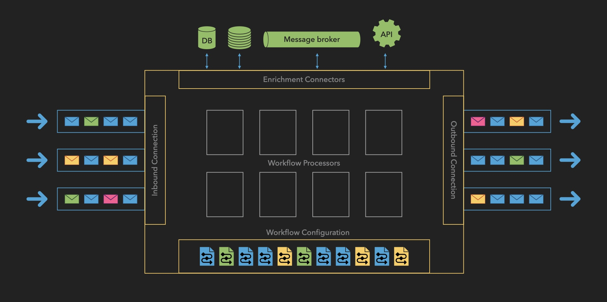

# How Open Payments Works?

The Message Processor adheres to a structured workflow that guarantees reliable and secure processing of payment messages. Please find below a comprehensive overview of each stage:

<figure><figcaption></figcaption></figure>

1. Inbound Connection
   1. Message Reception
      1. Accepts incoming messages from multiple sources:
         1. Bank APIs
         2. Financial gateways
         3. External systems
      2. Validates message format and structure
      3. Assigns a unique transaction identifier
   2. Queue Management
      1. Places messages in the inbound queue
      2. Maintains message priority
      3. Ensures ordered processing
2. Workflow Processor
   1. Message Retrieval
      1. Pulls messages from the inbound queue
      2. Maintains the processing order
      3. Manages throughput based on the system’s capacity
   2. Workflow Selection
      1. Matches messages to appropriate workflows based on:
         1. Payment type
         2. Originator
         3. Geographic region
         4. Message attributes
      2. Retrieves the workflow definition from storage
3.  Workflow Execution

    The system processes messages through a flexible combination of:

    1. Enrichment tasks
    2. Validation processes
    3. Transformation operations

    These steps can be repeated and reordered based on workflow requirements.
4. Error Management
   1. Error Detection
      1. Monitors the processing steps
      2. Identifies validation failures
      3. Catches system errors
      4. Flags data inconsistencies
   2. Recovery Procedures
      1. Implements retry logic for transient errors
      2. Routes to the error queue when needed
      3. Enables manual intervention
      4. Maintains the processing state
5. Outbound Processing
   1. Message Dispatch
      1. Routes messages to designated endpoints
      2. Supports multiple destinations
      3. Ensures secure transmission
      4. Verifies delivery
   2. Confirmation Handling
      1. Processes acknowledgments
      2. Updates the transaction status
      3. Maintains delivery records
      4. Handles failed deliveries
