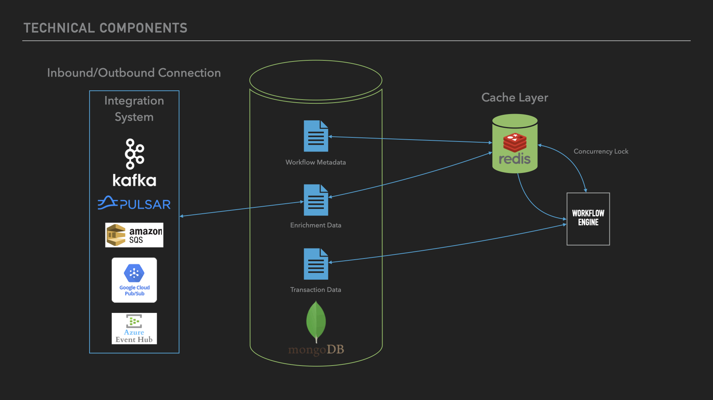

## Technical Architecture and Components

The Message Processor implements a modern, distributed architecture designed for reliability and efficient processing of large transaction volumes. The system comprises four core components that work in concert to ensure smooth message processing:

### Integration Layer
The integration system manages inbound and outbound connections, supporting multiple enterprise messaging platforms:
- **Supported Message Brokers**:
  - Apache Kafka
  - Apache Pulsar
  - Amazon SQS
  - Google Cloud Pub/Sub
  - Azure Event Hub
- **Key Features**:
  - Protocol-agnostic message handling
  - Automatic connection management
  - Message format validation
  - Delivery guarantee enforcement

### Data Storage Layer
MongoDB serves as the primary data store, managing three critical data types:
- **Workflow Metadata**:
  - Process definitions
  - Routing rules
  - Transformation logic
  - Business rules
- **Enrichment Data**:
  - Reference data
  - Lookup tables
  - Configuration parameters
- **Transaction Data**:
  - Message processing history
  - Audit trails
  - Processing results

### Cache Layer
Redis provides high-performance caching and concurrency control:
- **Primary Functions**:
  - Temporary data storage
  - Processing state management
  - Concurrency lock management
- **Key Features**:
  - Message deduplication
  - Race condition prevention
  - Processing speed optimization

### Workflow Engine
The core processing component orchestrates message handling:
- **Responsibilities**:
  - Workflow execution
  - State management
  - Data transformation
  - Rule application
- **Integration Points**:
  - Pulls workflow definitions from MongoDB
  - Uses Redis for concurrency control
  - Coordinates with integration layer
  - Manages transaction state

### System Interaction Flow
1. Messages arrive through the integration layer via supported message brokers
2. Workflow engine retrieves relevant workflow metadata from MongoDB
3. Redis manages processing locks and temporary state
4. Workflow engine executes the defined process
5. Results are stored in MongoDB and sent to outbound destinations