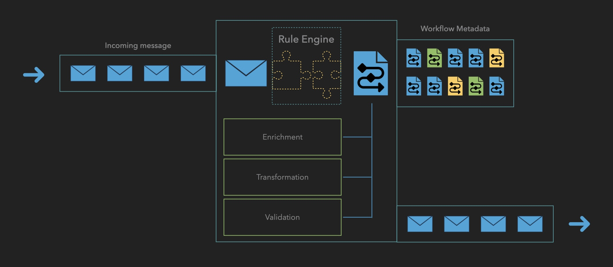

## Workflow Processor: Detailed Component Architecture

The Workflow Processor serves as the core processing engine, orchestrating the entire message handling lifecycle. Here's a detailed breakdown of its key components:

### 1. Incoming Message Queue
- **Primary Function**:
  - Initial reception point for payment messages
  - Message buffering and queuing
  - Load balancing support
- **Key Features**:
  - High-throughput message intake
  - Traffic spike handling
  - Message persistence
  - Order preservation

### 2. Rule Engine
- **Core Responsibilities**:
  - Workflow selection and assignment
  - Processing rule application
  - Dynamic decision making
- **Workflow Matching Criteria**:
  - Payment type
  - Message originator
  - Geographic region
  - Message attributes
  - Business rules
- **Integration Points**:
  - Direct access to Workflow Metadata
  - Connection to validation services
  - Interface with enrichment systems

### 3. Workflow Execution Steps
The Workflow Processor supports flexible combinations of three core processing tasks that can be arranged in any order and repeated as needed within a workflow:

#### Core Processing Tasks
- **Enrichment**:
  - Customer information addition
  - Account detail enhancement
  - Regulatory compliance data inclusion
  - External data retrieval
  
- **Validation**:
  - Data integrity checks
  - Mandatory field validation
  - Format verification
  - Regulatory compliance checks
  
- **Transformation**:
  - Format conversions
  - Data mapping
  - Schema adjustments

The actual sequence depends on:
- Message type requirements
- Business rules
- Regulatory needs
- Destination system requirements

Each step can be:
- Repeated multiple times
- Applied conditionally
- Executed in parallel where appropriate
- Skipped based on conditions

### 4. Workflow Metadata
- **Purpose**:
  - Workflow configuration storage
  - Processing step definitions
  - Business rule management
- **Structure**:
  - Workflow definitions
  - Processing sequences
  - Rule sets
  - Configuration parameters
- **Access Patterns**:
  - Rule Engine reference
  - Dynamic workflow loading
  - Configuration updates

### 5. Outbound Message Queue
- **Functions**:
  - Processed message buffering
  - Destination routing
  - Delivery management
- **Features**:
  - Multiple destination support
  - Retry handling
  - Load balancing
  - Message persistence