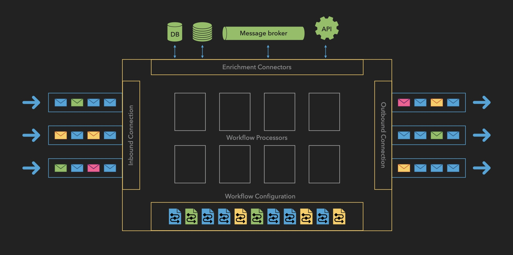

## How It Works: Operational Flow

The Message Processor follows a systematic workflow that ensures reliable, secure processing of payment messages. Here's a detailed breakdown of each stage:

### 1. Inbound Connection
- **Message Reception**
  - Accepts incoming messages from multiple sources:
    - Bank APIs
    - Financial gateways
    - External systems
  - Validates message format and structure
  - Assigns unique transaction identifier

- **Queue Management**
  - Places messages in inbound queue
  - Maintains message priority
  - Ensures ordered processing

### 2. Workflow Processor
- **Message Retrieval**
  - Pulls messages from inbound queue
  - Maintains processing order
  - Manages throughput based on system capacity

- **Workflow Selection**
  - Matches messages to appropriate workflows based on:
    - Payment type
    - Originator
    - Geographic region
    - Message attributes
  - Retrieves workflow definition from storage

### 3. Workflow Execution
The system processes messages through a flexible combination of:
- Enrichment tasks
- Validation processes
- Transformation operations

These steps can be repeated and reordered based on workflow requirements.

### 4. Error Management
- **Error Detection**
  - Monitors processing steps
  - Identifies validation failures
  - Catches system errors
  - Flags data inconsistencies

- **Recovery Procedures**
  - Implements retry logic for transient errors
  - Routes to error queue when needed
  - Enables manual intervention
  - Maintains processing state

### 5. Outbound Processing
- **Message Dispatch**
  - Routes to designated endpoints
  - Supports multiple destinations
  - Ensures secure transmission
  - Verifies delivery

- **Confirmation Handling**
  - Processes acknowledgments
  - Updates transaction status
  - Maintains delivery records
  - Handles failed deliveries