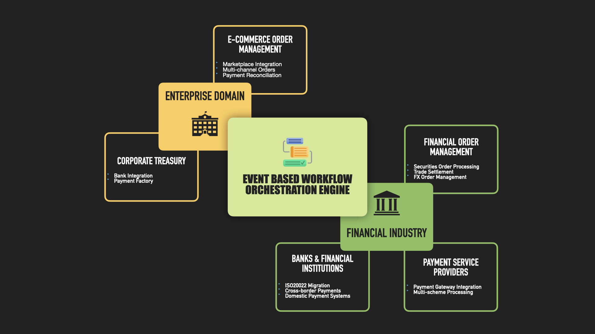

# What is Open Payments?

A workflow orchestration engine that processes messages in any standard format - whether JSON, XML, ISO20022, or other financial messaging standards. This format-agnostic platform enables you to configure workflows that validate, enrich, transform, and publish messages through predefined steps. Ideal for organizations handling diverse message formats and financial standards, the engine excels in:

1. Payment preprocessing and validation across different formats
2. End-to-end order management
3. Multi-format payment processing pipelines
4. Financial message transformation (ISO20022, SWIFT, etc.)
5. Cross-format data integration

<figure><figcaption></figcaption></figure>

The platform's flexibility allows financial institutions, payment providers, and enterprises to implement standardized processing workflows while supporting their existing message formats and standards. Configure once, process any format - streamlining your message handling without being locked into specific data structures or standards.
